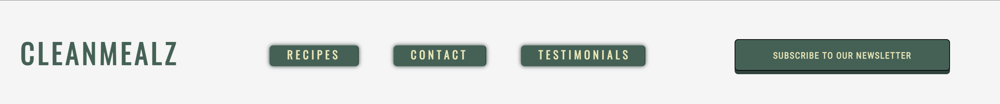

Clean Mealz is a website which users can find recipes for breakfast lunh or dinner.Clean Mealz targets cooks of all levels, be that a beginner or pro, Clean Mealz aims to have recipes accustometo all. Clen Mealz aims to help the cooks by providing step by step cooking guides, ingredients lists and nutrition information.

# Features 

## The Navigation Bar 

* The navigation bar allows users to quickly move to the recips page, newsletter sign up page as well as the contact section and testimonial section.
* The navigation bar also allows user to navigate back to the home page by clicking on the logo.

------
## The Home Page Image 
* The main image accompaided by the cover text on the home page lets the user know that the recipes easy to cook and hellthy.
* The image greets the user with a slow zoom effect.

## The Reasons For Following Clean Meals
* The why follow us section conveys to the user the benfits of following Clean Mealz Recipes.
    * The ingredients section explains how our meals are based off what is best for your health. But also acceisbily to certain ingredients. 
    * The goodness in section describes how our meals strive to have a multitude of health benefits. Such as sources of protein, vitimans and nutrients. 
    * The You Can Do It section shows thats the recipes are suitable to cooks of all levels.
    

## Favourites Section 
* The favourites section shows the user some of the mmost popular recipes that are available on the website. 
* Quick links directly to the recipe secions are provide for easy navigation for the user.
 

## Testimonials section 
* The testimonial section is a place to display fan reviews. This sections lets new users know that the recipes are easy to follow and delicious.

## The Footer 
* The Footer section provides very useful information to the user. 
    * Links to clean mealz social media pages are provided to user to encourage engagement on other platforms.
    * Contact information such as and email address and phone number are provided if users want to use those mediums for communication.
    * A link is also provided to sign up for the newsletter on certain device sizes. 

## Sign Up Page 
* The sign up page allows users to sign up for weely newsletter sent by clean mealz.
    * The form requires first name, second name, diet type and alergy inputs to have the most personalised emails sent to each member. 
    * The user is required to eneter an email. 

## Recipes Page 
# Recipe Navigation
* The recipe navigation allows the users to easily navigate to breakfast, lunch or dinner recipes.

# Our goal
* The Our Goal Section describes how clean mealz aims to help build cooking confidence for it's users.

# Recipe Section 
* The recipe section aims to help the user through the process of making th emeal.
    * The meal bio area describe to the reader why the recipe is great and why we love the meal.
    * The meal guide are lets the user know everything that they need to knoe.
        * The ingredients
        * The steps in preparing the meal
        * The nutritional information.

## Features Left To Implement
* Dropdown menu for each link in recipe navigation with links to each meal in that category.
* Navigation bar sticking to the header of the viewport for easier navigation through the site. 
## Lighthouse Testing
* The website was tested using lighthouse for seo, accessibilty, best practices and peroformance. 
 
## Validator Testing 
* HTML
    * No errors were found when the html code was tested in the W3C Validator. (https://validator.w3.org/)
* CSS 
    * No errors were detected when testing my code in the Jigsaw validator (https://jigsaw.w3.org/css-validator/)

## Deployment

* The site was deployed to GitHub pages. The steps to deploy are as follows:
    * In the GitHub repository, navigate to the code and automation section on the left of the screen.
    * From the source section drop-down menu, select the Master Branch
    * Once the master branch has been selected, the page will be automatically refreshed with a detailed ribbon display to indicate the successful deployment.
    * The live link can be found here 
## Credits 
# Content
* The text for recipe sections was taken from Derval O'Rourke's book "The Fit Foodie"
* The Our Goal Text was taken from SimplyRecipes.com (https://www.simplyrecipes.com/)
* The fonts used were imported using Foogle Fonts (https://fonts.google.com/)
* The incons used were imoprted from Font Awesome (https://fontawesome.com/)
# Media 
* The photos used wer found on Canva.com. (https://www.canva.com/)

# Code 
* Code used for Tel input on signup form was found on W3schools. (https://www.w3schools.com/tags/att_input_type_tel.asp)

* The hover effect used on Our Favourites section was found on CreativeTim (https://www.creative-tim.com/blog/tiktok-learning/image-card-hover-using-css-and-js-tutorial/)